<p align="center">
  
</p>

<p align="center">
  <strong>A self-evolving single-agent platform — writes its own skills, manages a vault-native knowledge base, and runs entirely on your machine.</strong>
</p>

---

## Why Nexus?

- **Self-evolving skills** — the agent creates, edits, and deletes its own skills at runtime, guarded by a static security scanner that blocks credential exfil and destructive shell patterns.
- **Vault + kanban + graph** — a markdown knowledge base with FTS5 search, Obsidian-compatible kanban boards (with a vault-wide board picker in the sidebar), an iCal calendar, DuckDB datatables with cross-table refs, and a 3D backlink graph, all stored as plain `.md` files.
- **Per-folder knowledge graphs** — right-click any vault folder → "Visualize as graph" defines a folder-local ontology (with an optional LLM wizard) and indexes that subtree into a portable `.nexus-graph/` next to the data, isolated from the global GraphRAG.
- **Git-backed vault history (opt-in)** — flip on in Settings → Features and every vault write/delete/move commits into a private `~/.nexus/.vault-history` work-tree. Right-click any file or folder → "Undo last change" steps that path back one commit at a time.
- **Human-in-the-loop** — `ask_user` and `terminal` tools gate actions behind SSE approval dialogs; YOLO mode for unattended runs. Web Push delivers prompts when the tab is closed.
- **Public tunnel, no account** — `nexus tunnel start` exposes the server through a Cloudflare Quick Tunnel with an 8-character access code. No signup, no secrets in URLs.
- **Packaged Mac app** — ships as `Nexus.app` with a bundled CPython, dependencies, web UI, and pre-downloaded embedding/spaCy models so it runs offline on a fresh Mac. Optionally rebuild with `--bundle-llm qwen-3b` to ship a Qwen2.5-3B model and skip the API-key requirement entirely.

---

## Quick Start

```bash
curl -fsSL https://raw.githubusercontent.com/NinoCoelho/nexus/main/install.sh | bash
```

Clones into `~/nexus`, installs [uv](https://docs.astral.sh/uv/) if missing, runs `uv sync` + `npm install`, and writes a default `~/.nexus/config.toml`.

Then:

```bash
nexus daemon start          # start the background server on port 18989
nexus chat                  # interactive TUI chat
```

Or open the web UI:

```bash
cd ~/nexus/ui && npm run dev   # http://localhost:1890
```

**API key**: set `OPENAI_API_KEY` (or `ANTHROPIC_API_KEY`, or any OpenAI-compatible key) before starting the daemon.

---

## Mac App

Download `Nexus.app` from the [Releases page](https://github.com/NinoCoelho/nexus/releases). The app bundles the backend, web UI, and menu bar controls — no terminal required. You'll still need to set an API key (or rebuild from source with `--bundle-llm qwen-3b` to include a local model).

---

## Docker

Run the whole stack — backend + bundled UI — in a single container, with persistent state on a named volume.

```bash
# Build and start (uses your shell env for API keys, or a .env in this dir)
OPENAI_API_KEY=sk-... docker compose up -d --build

# Open the UI
open http://localhost:18989

# Tail logs
docker compose logs -f

# Stop (data persists)
docker compose down
```

The compose recipe binds the published port to **127.0.0.1 only** — the container is reachable from the host, never the LAN. To share remotely, start the Cloudflare Quick Tunnel from inside the container:

```bash
docker exec -it nexus nexus tunnel start
```

#### How auth works in Docker

Nexus's auth middleware bypasses authentication only for loopback clients. Inside a container, requests reaching the published port have a docker-bridge source IP, not loopback — so the image runs `uvicorn` on `127.0.0.1` inside the container and uses a small `socat` proxy to forward the published port to it. The Python server only ever sees loopback clients, and the existing security model works unchanged. No code modification, no access tokens to juggle.

#### Plain `docker run`

```bash
docker build -t nexus .
docker run -d --name nexus \
  -p 127.0.0.1:18989:18989 \
  -v nexus-data:/home/nexus/.nexus \
  -e OPENAI_API_KEY=sk-... \
  nexus
```

The named volume holds `~/.nexus/` — sessions, vault, skills, secrets, and the auto-downloaded `cloudflared` binary — so upgrading the image (`docker compose up -d --build`) preserves all state.

---

## Table of Contents

- [Overview](#overview)
- [Key Features](#key-features)
- [Architecture](#architecture)
- [Project Layout](#project-layout)
- [Getting Started](#getting-started)
- [CLI Reference](#cli-reference)
- [API Reference](#api-reference)
- [Configuration Guide](#configuration-guide)
- [License](#license)

---

## Overview

Nexus is a self-evolving agentic platform with a Python FastAPI backend and a React 19 + Vite frontend. The agent can create, edit, and delete its own skills at runtime; manage a markdown knowledge vault with FTS + GraphRAG; operate Obsidian-compatible kanban boards, an iCal-style calendar, and DuckDB-backed datatables; trigger turns from calendar events; and interact with users through a human-in-the-loop approval system that streams via SSE and Web Push.

The agentic loop is powered by **Loom** — a reusable framework that provides the tool-calling iteration engine, LLM provider abstractions, session persistence, HITL broker, heartbeat drivers, GraphRAG memory, and error classification. Nexus layers on domain tools (vault, kanban, calendar, datatables, skill management, ontology), a rich web UI, TOML-based config, optional local LLMs (llama.cpp), public tunneling (Cloudflare Quick Tunnel, no account needed), and self-evolution.

```
┌─────────────────────────────────────────────────────────────────┐
│                         Nexus Platform                          │
│                                                                 │
│   ┌─────────────┐    ┌─────────────┐    ┌──────────────────┐    │
│   │  React UI   │◄──►│  FastAPI    │───►│  Loom Agent Loop │    │
│   │  (Vite)     │SSE │  Server     │    │  (Core Engine)   │    │
│   └─────────────┘    └──────┬──────┘    └───────┬──────────┘    │
│                             │                    │              │
│                    ┌────────▼─────────┐  ┌──────▼───────────┐   │
│                    │  Session Store   │  │  Tool Registry   │   │
│                    │  (SQLite WAL)    │  │  (20+ tools)     │   │
│                    └──────────────────┘  └──────┬───────────┘   │
│                                                 │               │
│      ┌─────────┬─────────┬─────────┬────────────┼──────────┐    │
│      │         │         │         │            │          │    │
│  ┌───▼───┐ ┌───▼────┐ ┌──▼─────┐ ┌─▼────┐ ┌─────▼────┐ ┌───▼──┐ │
│  │ Vault │ │Kanban+ │ │Skills+ │ │HITL +│ │Local LLM │ │Tunnel│ │
│  │GraphRAG│ │Calendar│ │ Guard │ │ Push │ │llama.cpp │ │tunnel│ │
│  └───────┘ └────────┘ └───────┘ └──────┘ └──────────┘ └──────┘  │
└─────────────────────────────────────────────────────────────────┘
```

## Key Features

| Feature | Description |
|---------|-------------|
| **Self-Evolving Agent** | Creates/edits/patches/deletes its own skills at runtime via `skill_manage`, with regex security guard + rollback |
| **Progressive Disclosure** | System prompt carries only skill names + descriptions; full bodies load on demand to keep tokens lean |
| **Sub-Agent Fan-Out** | `spawn_subagents` runs N agent loops in parallel with fresh contexts; recursion is bounded |
| **Persistent User Identity** | Loom `USER.md` is injected into the system prompt every turn; agent-edited via the `edit_profile` tool (permission-gated) |
| **Chat Slash Commands** | `/compact`, `/clear`, `/title`, `/usage`, `/help` — local-only fast paths handled before the LLM call |
| **Output Token Caps** | Per-model `max_output_tokens` with `[agent].default_max_output_tokens` fallback |
| **Multi-Provider LLMs** | Any OpenAI-compatible endpoint (OpenAI, Together, OpenRouter, Groq, vLLM) plus native Anthropic and local Ollama / llama.cpp |
| **Bundled Local LLM** | Ship-and-run Qwen2.5-3B-Instruct via llama.cpp; UI for searching / downloading / activating Hugging Face GGUFs. Fresh installs (and the macOS `.app`) auto-seed a default demo model so the agent works out of the box |
| **Reasoning Stream** | Streams `thinking` events from reasoning-capable models into a collapsible block above each assistant turn |
| **Vault Knowledge Base** | Markdown files + FTS5 search + tag index + backlinks graph + GraphRAG semantic recall |
| **3D Knowledge Graph** | Force-directed 3D / 2D vault graph with scoped views (file / folder / agent / sessions) |
| **Kanban Boards** | Vault-native (`kanban-plugin: basic`) — boards are markdown files; cards can dispatch chat sessions. Top-level **Kanban** view in the sidebar lists every board across the vault for fast switching |
| **Calendar** | Vault-native iCal-style events with RRULE recurrence, MonthGrid + WeekGrid views, RepeatPicker |
| **Calendar Triggers** | Heartbeat driver fires events on schedule into agent turns; supports single-shot and intra-day fire windows |
| **DataTables + CSV** | DuckDB-backed analytics tools and a CSV editor for tabular vault content. Ref columns infer a natural primary key when unset and open a popup preview of the referenced row on click |
| **Ontology Tool** | Agent-managed entity/relation schema for GraphRAG over the vault |
| **Per-Folder Knowledge Graphs** | Right-click a vault folder → "Visualize as graph" to define a folder-local ontology (optional LLM wizard samples files + asks disambiguation questions). Each open folder becomes a sub-tab in Knowledge mode with Reindex / Edit-ontology controls and a stale-files banner; the index lives in a hidden `.nexus-graph/` inside the folder so it travels with the data |
| **Vault History (opt-in)** | When enabled, every vault mutation (write/delete/move) commits into a private git work-tree at `~/.nexus/.vault-history`. Right-click → "Undo last change" steps a single file or whole folder back one commit; a per-path cursor keeps consecutive undos walking backwards |
| **Human-in-the-Loop** | `ask_user` (confirm/choice/text) and `terminal` (shell) gated by SSE approval dialogs; YOLO mode for unattended runs |
| **Web Push** | Background push notifications for HITL prompts when the tab is closed (VAPID) |
| **Public Tunnel** | One-click Cloudflare Quick Tunnel (no signup) with a login-form flow (URL + 8-char access code) — no secrets in URLs/logs; access code is single-use per activation (burned after first device redeems) |
| **Read-Only Share Links** | Publish a session as a read-only public link with a generated token |
| **Audio Transcription** | Local or remote transcription with live waveform + cancel UI |
| **Backup / Restore** | `nexus backup create` and `restore` for the entire `~/.nexus/` data directory |
| **In-Chat Search + Pins** | Cmd+Shift+F across the active session; pin assistant turns to a sidebar bookmarks list |
| **Edit User Messages** | Pencil-affordance on user turns rewinds + re-runs the conversation from that point |
| **Daemon Mode** | Background process with PID/log management and systemd / launchd / NSSM service installers |
| **Desktop App** | Packaged `Nexus.app` macOS bundle with menu bar autostart and prefs (loopback-only bind; remote access via `nexus tunnel`) |
| **Mobile-Friendly** | Capacitor-friendly responsive layout; iOS Xcode project scaffolding included |
| **One-Line Install** | `curl … | bash` clones, installs uv + deps, and writes a default config |
| **Docker Image** | Single multi-stage `Dockerfile` + `docker-compose.yml` — backend + bundled UI on one port, persistent state on a named volume, loopback auth model preserved via an internal `socat` proxy |
| **Skills From Git** | `nexus skills install <git-url-or-path>` |
| **ACP Bridge** | Optional Agent Communication Protocol over WebSocket with Ed25519 device auth |

---

## Architecture

### High-Level System Diagram

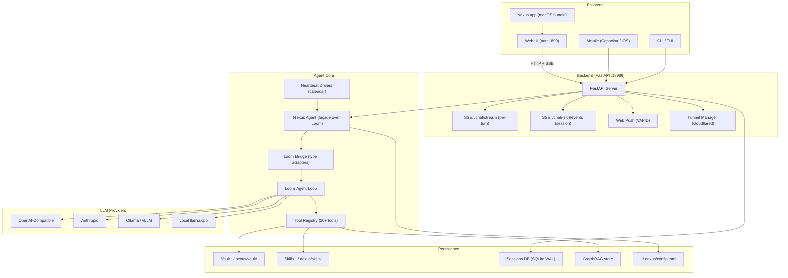

### Loom Integration

Nexus depends on **Loom** as a local editable path:

```toml
# agent/pyproject.toml
[tool.uv.sources]
loom = { path = "../../loom", editable = true }
```

Both repos live side by side:

```
<parent>/
  loom/    # git@github.com:NinoCoelho/loom.git
  nexus/   # this repo
```

Nexus does **not** use Loom's built-in server. It composes Loom via a façade + adapter pattern in `agent/src/nexus/agent/_loom_bridge/`:

| Loom Module | Nexus Usage |
|---|---|
| `loom.loop.Agent, AgentConfig` | Core tool-call loop, retry, streaming |
| `loom.tools.base.ToolHandler, ToolResult` | Base for tool adapters |
| `loom.tools.registry.ToolRegistry` | Tool dispatch |
| `loom.hitl.HitlBroker, HitlEvent` | Session-scoped HITL Future registry + pub/sub |
| `loom.heartbeat.HeartbeatDriver` | Calendar trigger driver |
| `loom.store.session.SessionStore` | SQLite session persistence |
| `loom.store.memory.MemoryStore` | BM25 + salience memory recall |
| `loom.acp.AcpConfig, call_agent` | Agent Communication Protocol |
| `loom.errors.*` | 7-stage error classification |
| `loom.types.*` | `Role`, `ToolSpec`, `Usage`, `ChatMessage`, stream events |
| `loom.search.WebSearchTool` | DDGS / Brave / Tavily web search |

The bridge resolves two type divergences:

| Concern | Nexus | Loom | Bridge Solution |
|---|---|---|---|
| `ToolCall.arguments` | `dict` | JSON `str` | `LoomProviderAdapter` converts at boundary |
| `ChatResponse` shape | flat | wrapped (`message=ChatMessage(...)`) | `LoomProviderAdapter` wraps/unwraps |

### Agent Loop

`agent/src/nexus/agent/loop/` is a façade over `loom.loop.Agent` that preserves the Nexus external API. Each turn:

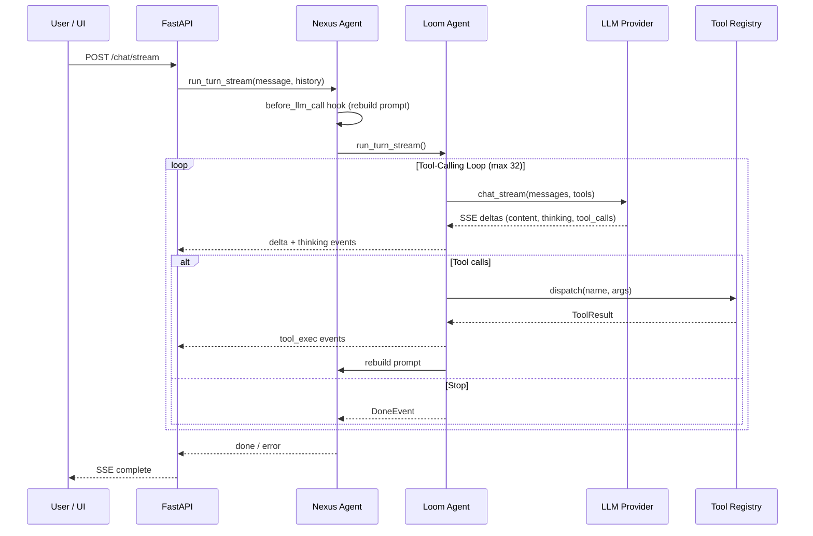

- **`before_llm_call` hook**: Rebuilds the system prompt every iteration so skill list + memory + ontology are always current.
- **Reasoning stream**: `thinking` events from reasoning-capable models render in a collapsible reasoning block on each assistant turn.
- **Max iterations**: 32 by default; configurable.
- **Streaming**: `run_turn_stream()` translates Loom Pydantic stream events into lightweight dict-based SSE events for the UI.

### Progressive Disclosure

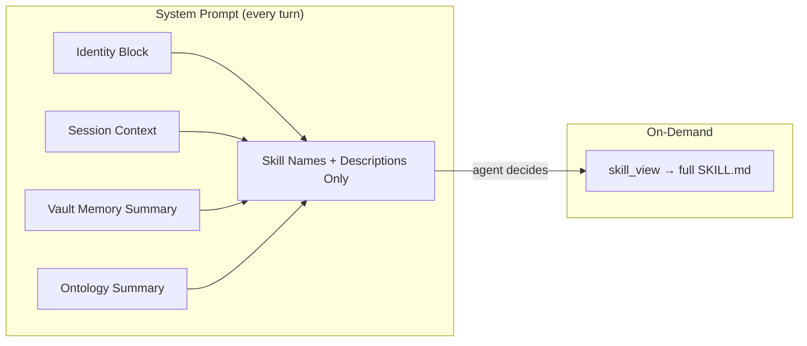

The agent only pays the token cost of a full skill body when it actively decides to use the skill.

### Tool System

Tools are registered into Loom's `ToolRegistry` via `_loom_bridge/registry.py`:

```mermaid
graph TB
    REG["Loom ToolRegistry"]

    subgraph "Knowledge"
        VL["vault_list / read / write / search / tags / backlinks"]
        VSEM["vault_semantic_search (GraphRAG)"]
        ONT["ontology_manage"]
    end

    subgraph "Boards & Schedules"
        KM["kanban_manage"]
        KQ["kanban_query"]
        DC["dispatch_card"]
        CAL["calendar_manage"]
    end

    subgraph "Tabular"
        DT["datatable_manage"]
        CSV["csv_tool"]
        VIS["visualize_table"]
    end

    subgraph "Skills & Identity"
        SL["skills_list"]
        SV["skill_view"]
        SM["skill_manage (create/edit/patch/delete)"]
        NKB["nexus_kb_search (BM25 over self-docs)"]
        EP["edit_profile (USER.md, permission-gated)"]
    end

    subgraph "Memory"
        MR["memory_read"]
        MW["memory_write"]
    end

    subgraph "Orchestration"
        SUB["spawn_subagents (parallel fan-out)"]
    end

    subgraph "External"
        HTTP["http_call"]
        WEB["web_search (DDGS / Brave / Tavily)"]
        SCR["web_scrape (Playwright + cookie store, optional)"]
        ACP["acp_call (optional)"]
    end

    subgraph "HITL"
        ASK["ask_user (confirm/choice/text)"]
        TERM["terminal (shell)"]
    end

    REG --> VL & VSEM & ONT
    REG --> KM & KQ & DC & CAL
    REG --> DT & CSV & VIS
    REG --> SL & SV & SM & NKB & EP
    REG --> MR & MW
    REG --> SUB
    REG --> HTTP & WEB & SCR & ACP
    REG --> ASK & TERM

    style REG fill:#1a1a2e,color:#fff
```

Each tool is wrapped in a `_SimpleToolHandler` that adapts sync/async callables to Loom's `ToolHandler` ABC. HITL tools use late-binding via a mutable `AgentHandlers` container so the server can wire them after construction. `acp_call` is registered only when an ACP gateway is configured. `web_search` is registered only when at least one provider is enabled in config; `web_scrape` only when `[scrape].enabled` is true. `spawn_subagents` resolves its runner through the same late-binding mechanism, and recursion is bounded by `SUBAGENT_DEPTH` so spawned children cannot themselves spawn.

A small dispatch wrapper auto-redirects tool calls whose name matches a known skill (with hyphen/underscore tolerance) into `skill_view` — smaller models routinely emit a tool call to a skill name as if it were a tool, and this stops the turn from being wasted on `Unknown tool`.

### Vault & Knowledge Graph

The vault (`~/.nexus/vault/`) is a folder of markdown files with rich indexing:

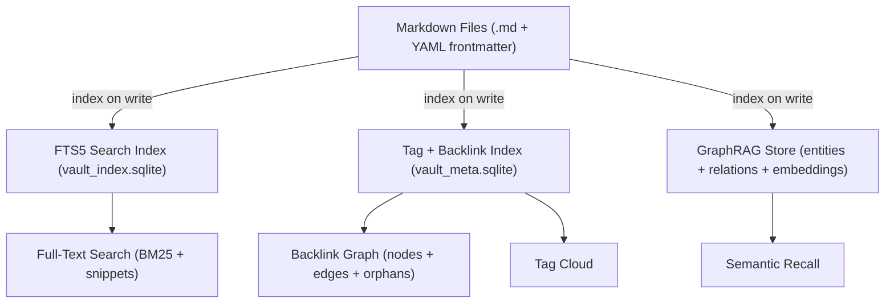

- Atomic writes (`tempfile.mkstemp` + `os.replace`).
- Path-traversal protection via `_safe_resolve()`.
- 1 MiB file size limit.
- Tag extraction from frontmatter `tags:` and body `#hashtags` (code blocks excluded).
- Backlink extraction from markdown links and bare path mentions.
- 3D / 2D unified graph view with scoped subgraphs (file / folder / agent / session).
- Per-folder graphs live alongside the global GraphRAG: each opened folder gets its own ontology + index inside a hidden `.nexus-graph/` next to the data, so a folder is portable and can be re-indexed in isolation. The Knowledge view exposes one sub-tab per open folder with Reindex / Edit-ontology controls and a stale-files banner driven by mtime drift.

### Kanban, Calendar, DataTables, CSV

The vault is more than markdown — Nexus parses several frontmatter shapes to power richer views, all stored as plain `.md` files:

| View | Frontmatter trigger | Notes |
|---|---|---|
| **Kanban** | `kanban-plugin: basic` | Obsidian-compatible. Lanes = `## H2`, cards = `### H3` with `<!-- nx:id=<uuid> -->`. Cards can dispatch chat sessions and link the session id back. |
| **Calendar** | `nx-calendar: true` events under a calendar root | iCal RRULE recurrence; MonthGrid + WeekGrid; EventModal + RepeatPicker UI. |
| **DataTable** | `nx-datatable: true` | DuckDB-backed CRUD with column types, filters, and inline cell editing. |
| **CSV** | file extension `.csv` | First-class editor inside `VaultEditorPanel`. |

The `dispatch_card` and `kanban_query` tools let the agent operate on boards directly. `calendar_manage` reads/writes events. `datatable_manage` and `csv_tool` mutate tabular data; `visualize_table` produces charts.

### Calendar Triggers (Heartbeat)

`agent/src/nexus/heartbeat_drivers/calendar_trigger/` is a Loom `HeartbeatDriver` that scans the vault every minute and dispatches events whose start time has arrived:

- **Single-shot**: `scheduled → triggered → done`. RRULE recurrences re-fire on each occurrence; only `cancelled` opts out. Per-occurrence dedup via a `fired_events` state map.
- **Intra-day fire window**: `all_day=true` + `fire_from` + `fire_to` + `fire_every_min` repeats inside a local time window without flipping status.
- Fired events flow through the same vault-dispatch pipeline as kanban cards, so the spawned session id is stamped back into the markdown atomically.

### Human-in-the-Loop (HITL)

Two SSE channels per session:

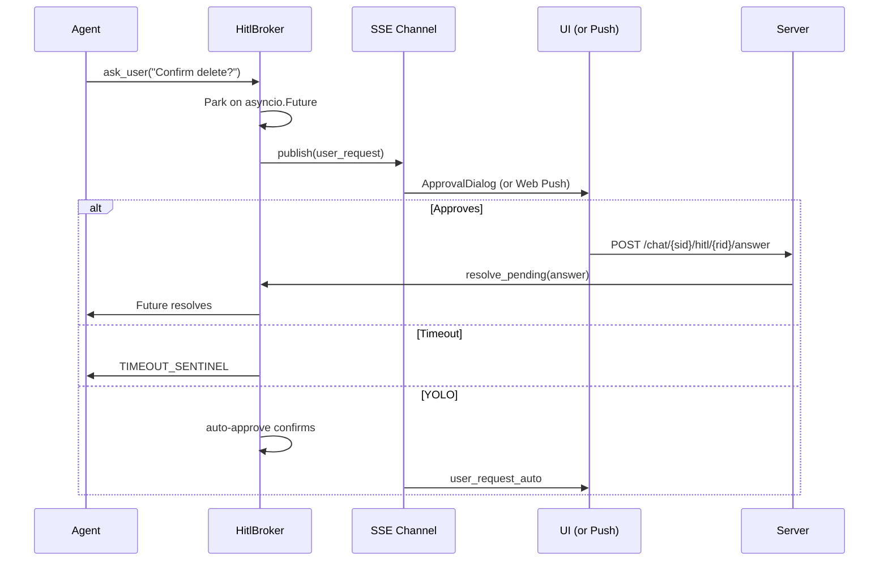

1. **Per-turn SSE** (`POST /chat/stream`): `delta`, `thinking`, `tool`, `done`, `limit_reached`, `error`.
2. **Session-scoped SSE** (`GET /chat/{sid}/events`): persistent channel for `user_request`, `user_request_auto`, `user_request_cancelled`. The UI opens this *before* the first POST using a client-generated `pendingSessionId`, so dialogs never miss events.

`/chat/{sid}/pending` lets a reloaded tab recover the in-flight question.

### Web Push Notifications

For mobile and closed-tab scenarios, Nexus also delivers HITL prompts as Web Push:

- Server exposes a VAPID public key via `/vapid-public-key`.
- Client subscribes via `/subscribe` (service worker registers the push manager).
- HITL events publish to the subscription, so the user sees a system notification even when the tab is in the background or the device is locked.

### Skill System & Self-Evolution

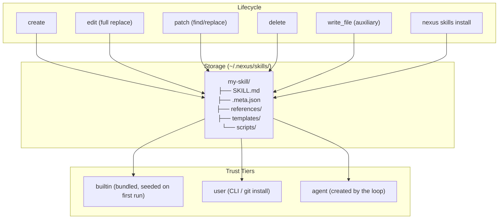

Skills are markdown with YAML frontmatter:

```markdown
---
name: my-skill
description: Does something useful
---

# Instructions for the agent...
```

Every agent-authored write passes through `skills/guard.py`:

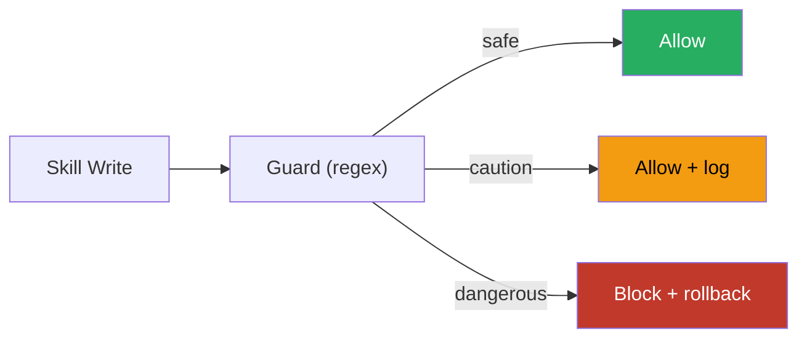

- **Dangerous** (block): credential exfil (`curl $TOKEN`, `.ssh/`, `.aws/`, `base64 + env`), destructive shell (`rm -rf /`, `dd`, `mkfs`), prompt injection.
- **Caution** (allow + log): persistence (`cron`, `launchd`, `systemd`, `.bashrc`).

### Identity & User Profile

Loom owns a per-user `USER.md` (under the Loom data home) that captures stable facts about the user — name, communication preferences, recurring projects, working hours. On every turn the prompt builder injects this profile into the system prompt so the agent doesn't have to relearn it from each conversation.

The agent updates the profile through the `edit_profile` tool. Writes are gated by Loom `AgentPermissions`: by default only `USER.md` is editable from the agent loop; the deeper `SOUL.md` / `IDENTITY.md` files return `permission_denied` unless the user explicitly raises permissions.

### Ontology Management

`ontology_tool` (and the matching `ontology_manage` system prompt) lets the agent maintain an entity/relation schema for GraphRAG:

- Define entity types (e.g. `Person`, `Project`) and relations (`worksOn`, `partOf`).
- The vault indexer enriches GraphRAG with these typed entities/relations.
- Semantic search (`vault_semantic_search`) walks the typed graph to retrieve context.

### Local LLMs

Nexus can run an LLM entirely on the user's machine via llama.cpp:

- Bundled default: **Qwen2.5-3B-Instruct** in the macOS app.
- `/local/*` API to inspect hardware, search Hugging Face, list/download GGUFs, activate / start / stop a local server.
- Integrates as just another OpenAI-compatible provider in the registry.

### Public Tunnel (Sharing)

`agent/src/nexus/tunnel/` wraps a tunnel provider (Cloudflare Quick Tunnel via `cloudflared`) so the local server can be exposed temporarily through a login-form flow. The `cloudflared` binary is auto-downloaded on first activation — no signup or authtoken required.

- `POST /tunnel/start` opens the tunnel and generates two secrets:
  - **long token** (32 bytes) — set as an `HttpOnly Secure SameSite=Strict` cookie after redemption. Never appears in any URL.
  - **short access code** (8 chars from `ABCDEFGHJKMNPQRSTUVWXYZ23456789`, formatted `XXXX-XXXX`) — typed by the user on the phone's login form. Never appears in any URL either; only travels in the POST body of `/tunnel/redeem`.
- `GET /tunnel/status` (loopback only) returns the URL **and** the access code so the desktop UI can display them.
- `POST /tunnel/stop` tears the tunnel down — both secrets are cleared, any in-flight cookies become 401.
- `POST /tunnel/redeem` (reachable through the tunnel without a cookie) takes `{code: ...}`, validates it timing-safely (`hmac.compare_digest`, normalized for case + dashes), and seats the cookie on success. Per-IP rate-limited (8 wrong attempts / 10 min) on top of the 32^8 ≈ 1.1e12 entropy. **The code is single-use per activation** — after the first successful redemption it is burned (subsequent redeem attempts fail and `/tunnel/status` no longer echoes it). To onboard another device, stop and restart the tunnel.
- `GET /tunnel/auth-status` (also reachable through the tunnel) tells the SPA whether to render the login form.

#### Network model

Nexus **always** binds to `127.0.0.1`. There is no `--host` flag and no way to expose the listener on `0.0.0.0` from the CLI. Remote access is exclusively via a tunnel that runs as a local client connecting *to* the loopback bind:

- `nexus tunnel start` — managed Cloudflare Quick Tunnel with the auth flow described above (auto-downloads `cloudflared`, no signup).
- Tailscale, ssh `-L`, etc. — same idea, bring-your-own.

The middleware separates **direct loopback** (no proxy headers → bundled UI on the user's own machine, zero-config bypass) from **tunnel-proxied** (proxy headers present → cookie required). Tunnel-public surface is a strict allowlist:

- `/tunnel/redeem` and `/tunnel/auth-status` — the login flow.
- Static SPA shell + `/assets`, `/icons`, `/manifest.json`, `/favicon.ico` — harmless, no secrets baked in.
- Everything else (`/chat`, `/sessions`, `/vault`, …) requires the cookie.

`/tunnel/start|stop|status|install` are loopback-only at the route level; even with a valid cookie, a tunnel-proxied request to those returns 403.

FastAPI's auto-generated `/docs`, `/redoc`, `/openapi.json` are disabled — the API surface isn't part of the public contract. Standard browser-hardening response headers (`X-Content-Type-Options`, `X-Frame-Options`, `Referrer-Policy`, `Permissions-Policy`) are set by `SecurityHeadersMiddleware`.

State is **in-memory only**; restarting the daemon resets the tunnel to off, which is intentional — activation is always explicit.

### Audio Transcription

`POST /transcribe` accepts audio and returns text. The UI provides a live waveform + timer + cancel during recording. Backed by either a local model or a remote provider, configurable in Settings.

### Session Persistence & Sharing

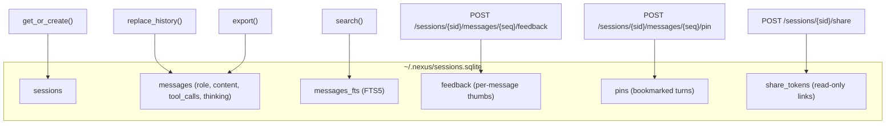

- **Pins**: Cmd-pin assistant turns; the sidebar shows a bookmarks list across sessions.
- **Per-message feedback**: thumbs up/down stored per turn, surfaced in `nexus insights`.
- **Read-only share links**: `POST /sessions/{sid}/share` mints a token; `GET /share/{token}` returns the public read-only view.
- **Compact / truncate**: `POST /sessions/{sid}/compact` and `/truncate` to manage long contexts.
- **Vault export**: `POST /sessions/{sid}/to-vault` saves raw or LLM-summarized.

Legacy migration is automatic: pre-Loom integer timestamps are converted to ISO format on first access.

### Daemon & Process Management

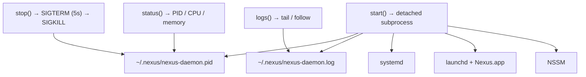

Includes orphan-process cleanup on restart and a packaged macOS app bundle (`Nexus.app`) with menu options for autostart, host/port preferences, and access-token management.

### Frontend Architecture

React 19 + Vite SPA. No external state management library — all state lives in `App.tsx` keyed by session id:

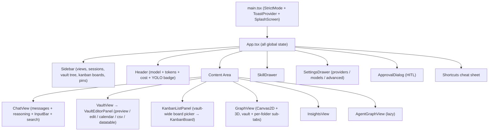

Frontend design decisions:

| Decision | Implementation |
|---|---|
| **State management** | `useState` + `useCallback` + `useRef` only |
| **Per-session state** | `Map<string, ChatState>` keyed by sid, with a `__new__` slot for not-yet-created sessions |
| **View switching** | `display: none/flex` (not conditional rendering) — preserves in-flight streaming |
| **SSE** | Manual `ReadableStream` parsing for POST SSE; native `EventSource` for session events |
| **Mermaid** | Lazy-loaded on first `language-mermaid` block |
| **3D graph** | force-graph + custom physics; 2D fallback |
| **Mobile** | Capacitor-friendly responsive layout; iOS Xcode project under `ui/ios/` |
| **Splash** | `SplashScreen` + `BrandMark` shown on first load (one chime, sessionStorage-gated) |
| **Theming** | Adaptive theme system with continuous brightness knob; tokens in `ui/src/tokens.css` |

---

## Project Layout

```
nexus/
├── agent/                              # Python backend
│   ├── pyproject.toml                  # Loom as local editable
│   └── src/nexus/
│       ├── cli/                        # Typer CLI (sessions, vault, kanban, skills, providers, models, …)
│       ├── main.py                     # Uvicorn entry
│       ├── daemon/                     # Background process + service installers
│       ├── config.py / config_file.py / config_schema.py
│       ├── secrets.py                  # 0600 secrets.toml
│       ├── redact.py                   # Secret redaction for logs
│       ├── insights/                   # Session analytics
│       ├── usage_pricing.py
│       ├── trajectory.py               # RL trajectory logger
│       ├── push/                       # Web Push (VAPID)
│       ├── tunnel/                     # Cloudflare Quick Tunnel manager
│       ├── local_llm/                  # llama.cpp lifecycle, HF search, downloads
│       ├── heartbeat_drivers/
│       │   └── calendar_trigger/       # Vault calendar event firing
│       ├── calendar_runtime.py
│       ├── agent/
│       │   ├── loop/                   # Façade over loom.loop.Agent
│       │   ├── _loom_bridge/           # Type adapters + tool registry builder
│       │   ├── llm/                    # OpenAI / Anthropic provider adapters
│       │   ├── prompt_builder.py       # Progressive-disclosure system prompt
│       │   ├── registry.py             # Provider registry
│       │   ├── planner.py              # Planner-executor split routing
│       │   ├── ontology_store.py       # Ontology persistence
│       │   ├── graphrag_manager/       # GraphRAG indexing + recall
│       │   ├── builtin_extractor/      # Entity/relation extraction
│       │   ├── builtin_embedder.py
│       │   ├── ask_user_tool.py        # HITL ask_user
│       │   └── terminal_tool.py        # HITL terminal
│       ├── server/
│       │   ├── app.py                  # Route registration
│       │   └── routes/
│       │       ├── chat.py / chat_stream.py
│       │       ├── sessions.py / sessions_vault.py
│       │       ├── vault.py / vault_kanban.py / vault_calendar.py / vault_datatable.py / vault_dispatch.py
│       │       ├── providers.py / models.py / config.py / settings.py
│       │       ├── local_llm.py / tunnel.py / push.py / share.py / notifications.py
│       │       ├── insights.py / graph.py
│       ├── skills/                     # SkillRegistry + SkillManager + guard
│       ├── tools/                      # vault, kanban, kanban_query, calendar, datatable, csv,
│       │                               # visualize, dispatch_card, ontology, memory, http, acp
│       ├── vault.py + vault_*.py       # vault search / index / graph / kanban / calendar / csv / datatable
│       └── tests/
├── ui/                                 # React frontend
│   ├── package.json                    # React 19 + Vite 6 + TypeScript 5.7
│   ├── vite.config.ts                  # Dev server :1890
│   ├── public/
│   │   ├── images/nexus_banner_splash.png
│   │   └── icons/
│   ├── ios/                            # Capacitor iOS project
│   └── src/
│       ├── App.tsx
│       ├── api.ts
│       ├── tokens.css
│       ├── toast/
│       └── components/
│           ├── ChatView.tsx
│           ├── AssistantMessage.tsx        # reasoning + structured tool results
│           ├── VaultView.tsx + VaultEditorPanel.tsx
│           ├── KanbanBoard.tsx
│           ├── CalendarView/                # MonthGrid + WeekGrid + RepeatPicker + EventModal
│           ├── GraphView.tsx + AgentGraphView.tsx + SubgraphCanvas3D.tsx
│           ├── InsightsView.tsx
│           ├── MarkdownView.tsx             # react-markdown + remark-gfm + lazy mermaid
│           ├── BrandMark.tsx + SplashScreen.tsx
│           ├── SettingsDrawer.tsx
│           ├── ApprovalDialog.tsx
│           └── …
├── skills/                             # Bundled skills (seeded on first run)
├── packaging/macos/                    # Nexus.app scaffolding
├── install.sh                          # One-line installer
├── Dockerfile                          # Multi-stage container image (UI + backend)
├── docker-compose.yml                  # Single-service compose recipe
├── docker/entrypoint.sh                # socat → loopback uvicorn launcher
├── .dockerignore
├── CLAUDE.md
└── LICENSE                             # Apache 2.0
```

---

## Getting Started

### One-Line Install

```bash
curl -fsSL https://raw.githubusercontent.com/NinoCoelho/nexus/main/install.sh | bash
```

Clones into `~/nexus` (override with `NEXUS_DIR=…`), installs [uv](https://docs.astral.sh/uv/) if missing, runs `uv sync` + `npm install`, writes a default `~/.nexus/config.toml`, and drops a `nexus` launcher into `~/.local/bin/`.

Env overrides: `NEXUS_DIR`, `NEXUS_REF`, `NEXUS_NO_UI=1`, `NEXUS_NO_INIT=1`.

### Docker Install

Run the whole stack — backend + bundled UI — in a single container, with all state on a named volume.

```bash
git clone git@github.com:NinoCoelho/nexus.git
cd nexus

# .env file or shell exports — at least one LLM key
echo "OPENAI_API_KEY=sk-..." > .env

docker compose up -d --build
open http://localhost:18989
```

Or with plain `docker run`:

```bash
docker build -t nexus .
docker run -d --name nexus \
  -p 127.0.0.1:18989:18989 \
  -v nexus-data:/home/nexus/.nexus \
  -e OPENAI_API_KEY=sk-... \
  nexus
```

#### What's in the image

| Stage          | Base                              | Output                             |
|----------------|-----------------------------------|------------------------------------|
| `ui-builder`   | `node:20-alpine`                  | `npm ci && npm run build` → UI dist |
| `backend-builder` | `python:3.12-slim-bookworm` + `uv` | populated `.venv` from `uv sync`   |
| `runtime`      | `python:3.12-slim-bookworm`       | `socat` + `dumb-init` + the above  |

The runtime stage runs as a non-root `nexus` user (uid 1000), exposes `18989`, and mounts `/home/nexus/.nexus` as a volume — the same directory layout described under [Data Directory Layout](#configuration-guide), persisted across rebuilds.

#### How auth works in the container

Nexus's auth middleware grants automatic bypass only to loopback clients (`127.0.0.1`, `::1`). Inside a container, requests reaching the published port have the docker-bridge source IP, not loopback, so a bare bind to `0.0.0.0` would 401 every request.

The image keeps `uvicorn` on `127.0.0.1:18988` (internal) and runs a small `socat` proxy that forwards the published `0.0.0.0:18989` to it. From the Python server's perspective every request comes from `127.0.0.1` — the existing auth model holds, no application code changes, no access tokens to juggle.

```
host:18989  ──►  container:18989 (socat, 0.0.0.0)  ──►  127.0.0.1:18988 (uvicorn)
                                                              │
                                                              ▼
                                                 LoopbackOrTokenMiddleware
                                                 → bypass (loopback client)
```

The compose file binds the host port to `127.0.0.1:18989` only, so the container is reachable from the host — never the LAN — by default.

#### Sharing publicly from the container

`nexus tunnel start` works inside the container exactly like on the host. The `cloudflared` binary is auto-downloaded into `~/.nexus/bin/` (i.e. on the volume), so the second tunnel start is instant.

```bash
docker exec -it nexus nexus tunnel start
docker exec -it nexus nexus tunnel status      # URL + access code + QR
docker exec -it nexus nexus tunnel stop
```

#### Configuration & runtime env

| Variable                    | Default                | Purpose                                                |
|-----------------------------|------------------------|--------------------------------------------------------|
| `NEXUS_PORT`                | `18989`                | Externally-visible container port (what `socat` binds) |
| `NEXUS_INTERNAL_PORT`       | `18988`                | Loopback port `uvicorn` actually listens on            |
| `NEXUS_UI_DIST`             | `/app/ui/dist`         | Pre-built SPA served bundled by the backend            |
| `NEXUS_BUILTIN_SKILLS_DIR`  | `/app/skills`          | Bundled skills source for first-run seeding            |
| `OPENAI_API_KEY` / `ANTHROPIC_API_KEY` / `NEXUS_LLM_*` | — | Provider credentials, picked up at startup |
| `NEXUS_UID` / `NEXUS_GID`   | `1000` (build args)    | Non-root user/group inside the image                   |

Persisted state on the `nexus-data` volume:

```
/home/nexus/.nexus/
├── config.toml          (auto-initialized on first boot)
├── secrets.toml
├── sessions.sqlite
├── vault/  vault_index.sqlite  vault_meta.sqlite
├── graphrag/
├── skills/              (bundled skills seeded on first run)
├── local_llm/
├── push/
└── bin/                 (auto-downloaded cloudflared)
```

#### Day-to-day commands

```bash
docker compose logs -f                          # tail logs
docker compose restart nexus                    # restart
docker compose exec nexus nexus chat            # TUI chat inside the container
docker compose exec nexus nexus skills list     # any CLI subcommand works
docker compose down                             # stop (volume keeps data)
docker compose down -v                          # nuke everything (data included)
```

To upgrade: `git pull && docker compose up -d --build` — the named volume keeps your sessions, vault, skills, and tunnel binary across image rebuilds.

### Manual Install

Prerequisites: Python 3.12+, [uv](https://docs.astral.sh/uv/), Node 20+.

```bash
# Clone both repos side by side
git clone git@github.com:NinoCoelho/loom.git ../loom
git clone git@github.com:NinoCoelho/nexus.git
cd nexus/agent

uv sync
uv run nexus config init

export OPENAI_API_KEY=sk-...
export ANTHROPIC_API_KEY=sk-ant-...

uv run nexus config show
uv run nexus providers list
uv run nexus models list
```

#### Optional skill extras

Some bundled skills depend on extra Python packages or system assets. Install only what you need:

```bash
# Enables the `pdf-maker` skill (Pillow + fpdf2)
uv sync --extra pdf

# Enables full browser scraping for the `web-scrape` skill (downloads Playwright browsers, ~500MB)
uv run scrapling install --force
```

`web-scrape` works out-of-the-box for static HTTP requests via `Fetcher.get()` — only the JS-rendered / anti-bot fetchers (`PlayWrightFetcher`, `StealthyFetcher`) require the browser install above.

For best `pdf-maker` output, also drop the Inter and Montserrat font families into `~/.nexus/fonts/`. Without them the renderer falls back to Arial.

### Run

#### Daemon Mode (Recommended)

```bash
uv run nexus daemon start          # background daemon on port 18989
uv run nexus daemon status
uv run nexus daemon logs --follow
uv run nexus daemon stop
```

#### System Service

```bash
uv run nexus daemon install --user    # systemd / launchd auto-start
uv run nexus daemon uninstall --user
```

#### macOS App

A packaged `Nexus.app` bundle lives in `packaging/macos/`. Menu bar options cover autostart and port preferences. The app always binds to `127.0.0.1`; remote access goes through `nexus tunnel`.

#### Manual Server + UI

```bash
uv run nexus serve --port 18989    # foreground

cd ../ui
npm install
npm run dev                        # http://localhost:1890
```

The UI reads its API base from `VITE_NEXUS_API` (default `http://localhost:18989`).

#### CLI Only

```bash
uv run nexus chat
```

Bundled skills from `skills/` are copied into `~/.nexus/skills/` on first run (and on subsequent restarts when new bundled skills appear) and marked `trust="builtin"`. Skills you delete locally stay deleted — the seeder tracks what it has installed in `~/.nexus/skills/.seeded-builtins.json`. The bundled set includes `nexus` (self-docs, queried via `nexus_kb_search`), `markitdown` (doc → markdown ingestion), `pdf-maker`, `web-scrape`, `deep-research`, `parallel-research`, `summarize-file`, `vault-curator`, `ontology-curator`, `code-review-local`, `daily-standup`, and `brainstorm`.

If no model is configured (fresh install or the macOS `.app`), the local-LLM manager auto-seeds a small bundled demo model and points `[agent].default_model` at it, so the agent answers immediately without requiring an API key.

---

## CLI Reference

### Daemon

```bash
nexus daemon start [--port 18989] [--detach/--no-detach]
nexus daemon stop | restart | status
nexus daemon logs [--lines 50] [--follow]
nexus daemon install [--user|--system]
nexus daemon uninstall [--user|--system]
```

The listener always binds to `127.0.0.1`. To expose remotely, use `nexus tunnel start` (or any local-client tunnel like tailscale / ssh `-L`).

### Tunnel (Public Sharing)

```bash
nexus tunnel start                            # opens tunnel, prints URL + access code + QR
nexus tunnel status
nexus tunnel stop
nexus tunnel install                          # (optional) pre-download cloudflared binary
```

Uses Cloudflare Quick Tunnel (via the `cloudflared` binary, auto-downloaded on first use). No signup, no authtoken, no account.

The phone navigates to the URL, the SPA detects the missing cookie, shows a login form. The user types the 8-character access code → server seats an HttpOnly cookie → app loads. The code is the credential; the URL alone is harmless.

### Server & Chat

```bash
nexus serve [--port 18989]
nexus chat  [--session <id>] [--model <id>] [--context <str>]
```

### Configuration

```bash
nexus config init | show | path
nexus providers list | add <name> --base-url <url> [--key-env <VAR>] | remove <name>
nexus models    list | add <id> --provider <p> --model <name> [--tags ...] | remove <id> | set-default <id>
nexus skills    list | view <name> | install <git-url-or-path> | remove <name>
nexus version
nexus doctor
```

### Sessions / Vault

```bash
nexus sessions list | show <id> | export <id> | import <path> | edit <id> | stats | query <q>
nexus vault     ls | search <q> | reindex | tags | backlinks <path>
nexus kanban    boards | list [--board default]
nexus insights  [--days 30] [--json]
nexus backup    create [--out <path>] | restore <path>
```

### Chat Slash Commands

A user message that starts with `/` is intercepted before the LLM call and handled locally — no tokens spent. The registry lives in [agent/src/nexus/server/routes/chat_slash.py](agent/src/nexus/server/routes/chat_slash.py).

| Command | Description |
|---|---|
| `/compact [aggressive]` | LLM-summarize older turns. `aggressive` lowers the per-message threshold to catch medium-sized tool results. |
| `/clear` | Wipe session history (with confirmation prompt). |
| `/title <new title>` | Rename the session. Empty arg echoes the current title. |
| `/usage` | Token + cost breakdown for the session. |
| `/help` | List all available slash commands. |

---

## API Reference

### Chat & HITL

| Route | Method | Description |
|---|---|---|
| `/chat` | POST | Non-streaming turn |
| `/chat/stream` | POST | SSE per-turn (delta, thinking, tool, done) |
| `/chat/{sid}/events` | GET | SSE session-scoped (user_request, cancellations) |
| `/chat/{sid}/pending` | GET | Recover pending HITL after reload |
| `/chat/{sid}/hitl/{rid}/answer` | POST | Resolve pending HITL |
| `/chat/{sid}/cancel` | POST | Cancel in-flight turn |

### Sessions

| Route | Method | Description |
|---|---|---|
| `/sessions` | GET | List |
| `/sessions/search` | GET | FTS5 search |
| `/sessions/{sid}` | GET / PATCH / DELETE | CRUD |
| `/sessions/{sid}/export` | GET | Markdown |
| `/sessions/{sid}/to-vault` | POST | Save (raw or summarized) |
| `/sessions/{sid}/share` | POST | Mint read-only share token |
| `/sessions/{sid}/compact` | POST | LLM-summarize older turns |
| `/sessions/{sid}/truncate` | POST | Drop tail |
| `/sessions/{sid}/usage` | GET | Token / cost breakdown |
| `/sessions/{sid}/trajectories` | GET | RL trajectory log |
| `/sessions/{sid}/messages/{seq}/pin` | POST | Bookmark a turn |
| `/sessions/{sid}/messages/{seq}/feedback` | POST | Thumbs up/down |
| `/sessions/import` | POST | Import markdown |
| `/share/{token}` | GET | Public read-only view |
| `/pins` | GET | All bookmarked turns |

### Vault

| Route | Method | Description |
|---|---|---|
| `/vault/tree` | GET | File tree |
| `/vault/file` | GET / PUT / DELETE | Read / write / delete |
| `/vault/folder` | POST | Create folder |
| `/vault/move` | POST | Move/rename |
| `/vault/search` | GET | FTS5 |
| `/vault/reindex` | POST | Rebuild index |
| `/vault/graph` | GET | Backlink graph |
| `/vault/tags` / `/vault/tags/{tag}` | GET | Tag index |
| `/vault/backlinks` | GET | Backlinks |
| `/vault/dispatch` | POST | Spawn session from file/card |
| `/vault/calendar*` | GET / POST / PATCH / DELETE | Calendar events + RRULE + manual fire |
| `/vault/csv*` | GET / POST / PATCH / DELETE | CSV editor |
| `/vault/history/status` | GET | Git-backed history enabled? |
| `/vault/history/enable` / `/disable` | POST | Toggle history layer (initializes `~/.nexus/.vault-history`) |
| `/vault/history` | GET | List commits touching a path |
| `/vault/history/undo` | POST | Step a path back one real commit (per-path cursor) |
| `/vault/history/purge` | POST | Drop the history work-tree |
| `/graphrag/reindex` | POST | Rebuild GraphRAG store |
| `/graph/knowledge*` | GET / POST | Vault-wide GraphRAG entities, subgraphs, queries, indexing status |
| `/graph/folder/open` | POST | Open a folder as a knowledge sub-tab |
| `/graph/folder/ontology` | GET / PUT | Read or replace the folder-local ontology |
| `/graph/folder/index` / `/index-cancel` | POST | Index (or cancel) a folder into its `.nexus-graph/` |
| `/graph/folder/stale` | GET | Files whose mtime drifted from the folder index |
| `/graph/folder/subgraph` / `/full-subgraph` | GET | Folder-scoped graph slices |
| `/graph/folder/query` | POST | Folder-scoped GraphRAG query |
| `/graph/folder/ontology-wizard/start` / `/answer` | POST | LLM-driven ontology bootstrap |

### Kanban

| Route | Method | Description |
|---|---|---|
| `/vault/kanban` | GET / POST | Read / create board |
| `/vault/kanban/cards` | POST | Add card |
| `/vault/kanban/cards/{id}` | PATCH / DELETE | Update / move / delete card |
| `/vault/kanban/lanes` | POST | Add lane |
| `/vault/kanban/lanes/{id}` | DELETE | Delete lane |

### Local LLMs

| Route | Method | Description |
|---|---|---|
| `/local/hardware` | GET | CPU / RAM / GPU |
| `/local/hf/search` | GET | Hugging Face search |
| `/local/hf/repo/{owner}/{repo}/files` | GET | Repo file list |
| `/local/installed` | GET / DELETE | Installed GGUFs |
| `/local/download` / `/downloads` | POST / GET | Download mgmt |
| `/local/activate` | POST | Set active model |
| `/local/start` / `/local/stop` | POST | llama.cpp lifecycle |

### Tunnel & Notifications

| Route | Method | Description |
|---|---|---|
| `/tunnel/start` / `/stop` / `/status` | POST / GET | Tunnel lifecycle |
| `/tunnel/install` | POST | Pre-download cloudflared binary |
| `/vapid-public-key` | GET | Web Push public key |
| `/subscribe` | POST | Register push subscription |
| `/notifications/events` / `/pending` / `/history` | GET | Push channel state |
| `/transcribe` | POST | Audio → text |

### Config / Models / Settings

| Route | Method | Description |
|---|---|---|
| `/config` | GET / PATCH | View / update config |
| `/providers` | GET | List with key status |
| `/providers/{name}/models` | GET | Upstream model list |
| `/providers/{name}/key` | POST / DELETE | Set / clear API key |
| `/models` / `/models/{id:path}` | GET / POST / DELETE | Model CRUD |
| `/models/roles` / `/models/suggest-tier` | GET | Role mapping helpers |
| `/routing` | GET / PUT | Routing config |
| `/settings` | GET / POST | YOLO mode + preferences |

### Misc

| Route | Method | Description |
|---|---|---|
| `/health` | GET | Liveness |
| `/skills` / `/skills/{name}` | GET | Skill list / body |
| `/graph` | GET | Agent / skill / session graph |
| `/insights` | GET | Token / cost / model / tool analytics |

---

## Configuration Guide

The canonical config lives at `~/.nexus/config.toml`:

```toml
[agent]
default_model = "gpt-4o"
max_iterations = 32
# Global per-call output cap. `0` defers to Loom's AgentConfig default.
# Per-model `max_output_tokens` (below) wins when > 0.
default_max_output_tokens = 0

[providers.openai]
type = "openai_compat"
base_url = "https://api.openai.com/v1"
api_key_env = "OPENAI_API_KEY"

[providers.anthropic]
type = "anthropic"
base_url = "https://api.anthropic.com"
api_key_env = "ANTHROPIC_API_KEY"

[providers.local]
type = "ollama"
base_url = "http://localhost:11434/v1"

[[models]]
id = "gpt-4o"
provider = "openai"
model_name = "gpt-4o"
tags = ["fast", "capable"]
# Optional: override `[agent].default_max_output_tokens` for this model only.
max_output_tokens = 4096

[[models]]
id = "claude-sonnet"
provider = "anthropic"
model_name = "claude-sonnet-4-20250514"
tags = ["reasoning", "coding"]

# GraphRAG over the vault. Enabled by default — set `enabled = false` to skip.
[graphrag]
enabled = true

# Web search tool. Provider list is iterated in order; DDGS needs no key.
[search]
enabled = true
strategy = "concurrent"  # or "sequential" / "first-success"
[[search.providers]]
type = "ddgs"
[[search.providers]]
type = "brave"
key_env = "BRAVE_API_KEY"
[[search.providers]]
type = "tavily"
key_env = "TAVILY_API_KEY"

# Web scrape tool (Playwright + cookie store at ~/.nexus/cookies/).
# Disabled by default — flip to true and run `uv run scrapling install` for browsers.
[scrape]
enabled = false
mode = "auto"        # "static" | "playwright" | "stealthy" | "auto"
headless = true
timeout = 30
max_content_bytes = 102400

# Git-backed vault history. Disabled by default; can also be toggled from
# Settings → Features. When enabled, every vault write/delete/move commits
# into a private git work-tree at ~/.nexus/.vault-history.
[vault.history]
enabled = false
```

### Environment Variable Override

When **all three** are set, they override the config file:

```bash
export NEXUS_LLM_BASE_URL="https://api.openai.com/v1"
export NEXUS_LLM_API_KEY="sk-..."
export NEXUS_LLM_MODEL="gpt-4o"
```

### Data Directory Layout

```
~/.nexus/
├── config.toml          # Main configuration
├── secrets.toml         # API keys (0600)
├── settings.json        # UI preferences (YOLO mode, theme)
├── sessions.sqlite      # Sessions + messages + FTS + pins + feedback + share tokens
├── vault/               # Markdown knowledge base
│   └── <folder>/.nexus-graph/   # Per-folder ontology-isolated graph (when opened)
├── vault_index.sqlite   # FTS5 search index
├── vault_meta.sqlite    # Tag + backlink index
├── .vault-history/      # Git work-tree of vault mutations (only if [vault.history] enabled)
├── graphrag/            # Vault-wide GraphRAG store (entities + relations + embeddings)
├── skills/              # Agent skills
├── local_llm/           # Downloaded GGUFs
├── push/                # VAPID keys + subscriptions
├── nexus-daemon.pid
└── nexus-daemon.log
```

API keys are referenced by environment variable name (`api_key_env`), never stored inline. The secrets store at `~/.nexus/secrets.toml` is 0600 permission-guarded.

---

## License

Licensed under the [Apache License 2.0](LICENSE).

```
Copyright 2024 Nino Coelho

Licensed under the Apache License, Version 2.0 (the "License");
you may not use this file except in compliance with the License.
You may obtain a copy of the License at

    http://www.apache.org/licenses/LICENSE-2.0

Unless required by applicable law or agreed to in writing, software
distributed under the License is distributed on an "AS IS" BASIS,
WITHOUT WARRANTIES OR CONDITIONS OF ANY KIND, either express or implied.
See the License for the specific language governing permissions and
limitations under the License.
```
