<picture>
  <source media="(prefers-color-scheme: dark)" srcset="https://img.shields.io/badge/Nexus-Agentic%20Platform-copper?style=for-the-badge&labelColor=1a1a2e&color=b87333">
  
</picture>

**A self-evolving single-agent platform** with runtime skill authoring, a tool-calling agentic loop powered by [Loom](../../loom), pluggable LLM providers, optional auto-routing, vault-native knowledge management, kanban boards, and a full-featured React web UI.

---

## Table of Contents

- [Overview](#overview)
- [Key Features](#key-features)
- [Architecture](#architecture)
  - [High-Level System Diagram](#high-level-system-diagram)
  - [Loom Integration](#loom-integration)
  - [Agent Loop](#agent-loop)
  - [Progressive Disclosure](#progressive-disclosure)
  - [Tool System](#tool-system)
  - [Vault & Knowledge Graph](#vault--knowledge-graph)
  - [Kanban System](#kanban-system)
  - [Human-in-the-Loop (HITL)](#human-in-the-loop-hitl)
  - [Skill System & Self-Evolution](#skill-system--self-evolution)
  - [Security Guard](#security-guard)
  - [Model Routing](#model-routing)
  - [Configuration System](#configuration-system)
  - [Session Persistence](#session-persistence)
  - [Daemon & Process Management](#daemon--process-management)
  - [Frontend Architecture](#frontend-architecture)
- [Project Layout](#project-layout)
- [Getting Started](#getting-started)
- [CLI Reference](#cli-reference)
- [API Reference](#api-reference)
- [Configuration Guide](#configuration-guide)
- [Design Tokens](#design-tokens)
- [License](#license)

---

## Overview

Nexus is a self-evolving agentic platform that combines a Python FastAPI backend with a React 19 + Vite frontend. The agent can create, edit, and delete its own skills at runtime, manage a markdown-based knowledge vault, operate kanban boards, and interact with users through a human-in-the-loop (HITL) approval system.

The core agentic loop is powered by **Loom** — a reusable agentic framework that provides the tool-calling iteration engine, LLM provider abstractions, session persistence, HITL broker, and error handling. Nexus builds on Loom by adding domain-specific tools (vault, kanban, skill management), a rich web UI, TOML-based configuration, and self-evolution capabilities.

```
┌─────────────────────────────────────────────────────────────────┐
│                         Nexus Platform                          │
│                                                                 │
│   ┌─────────────┐    ┌─────────────┐    ┌──────────────────┐   │
│   │  React UI   │◄──►│  FastAPI    │───►│  Loom Agent Loop │   │
│   │  (Vite)     │SSE │  Server     │    │  (Core Engine)   │   │
│   └─────────────┘    └──────┬──────┘    └───────┬──────────┘   │
│                             │                    │              │
│                    ┌────────▼────────┐  ┌───────▼──────────┐   │
│                    │ Session Store   │  │  Tool Registry   │   │
│                    │ (SQLite WAL)    │  │  (15+ tools)     │   │
│                    └─────────────────┘  └───────┬──────────┘   │
│                                                  │              │
│                              ┌───────────────────┼──────────┐   │
│                              │                   │          │   │
│                        ┌─────▼─────┐   ┌────────▼───┐  ┌──▼────────┐
│                        │   Vault   │   │   Skills   │  │  HITL     │
│                        │  + Kanban │   │  + Guard   │  │  Broker   │
│                        └───────────┘   └────────────┘  └───────────┘
└─────────────────────────────────────────────────────────────────┘
```

## Key Features

| Feature | Description |
|---------|-------------|
| **Self-Evolving Agent** | Creates, edits, patches, and deletes its own skills at runtime via `skill_manage` tool with security guard scanning |
| **Progressive Disclosure** | System prompt carries only skill names + descriptions; full bodies are loaded on demand to minimize token usage |
| **Multi-Provider** | Any OpenAI-compatible endpoint (OpenAI, Together, OpenRouter, Groq, LM Studio, Ollama, vLLM) plus native Anthropic |
| **Auto Routing** | Optional per-task model selection by classifying coding/reasoning/trivial/balanced and scoring model strengths |
| **Vault Knowledge Base** | Markdown files with FTS5 search, backlinks graph, tag indexing, and Obsidian-compatible kanban boards |
| **Kanban Boards** | Vault-native boards stored as `.md` files with `kanban-plugin:` frontmatter — no separate store |
| **Human-in-the-Loop** | `ask_user` (confirm/choice/text) and `terminal` (shell commands) with YOLO mode for unattended runs |
| **Dual Interface** | Terminal CLI (`nexus chat`) and full web UI with chat, vault, graph, agent-graph, and insights views |
| **Daemon Mode** | Background process with PID tracking, log management, and cross-platform service installation |
| **ACP-Ready** | Agent Communication Protocol stub for inter-agent communication via external gateways |

---

## Architecture

### High-Level System Diagram

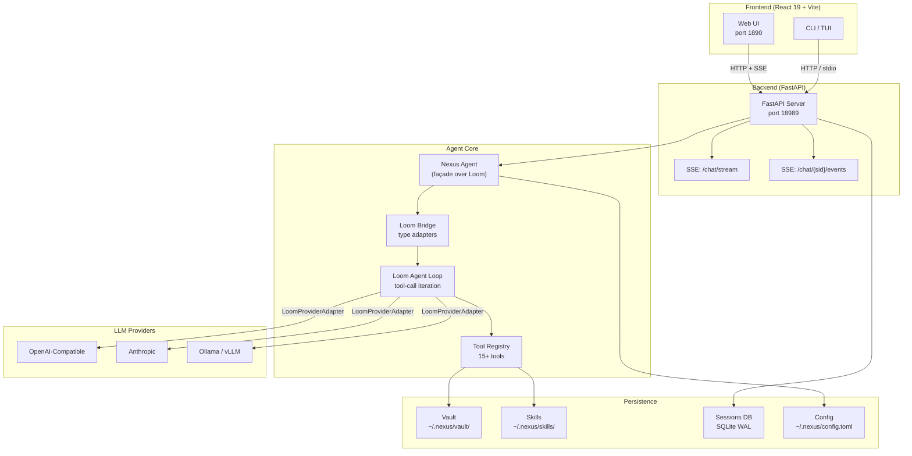

### Loom Integration

Nexus is built on top of **Loom**, a reusable agentic-core framework that provides the fundamental infrastructure for LLM-powered agents. Loom is installed as a local editable dependency:

```toml
# agent/pyproject.toml
[tool.uv.sources]
loom = { path = "../../loom", editable = true }
```

Both repositories must be cloned side by side:

```
<parent>/
  loom/    # git@github.com:NinoCoelho/loom.git
  nexus/   # this repo
```

#### What Loom Provides

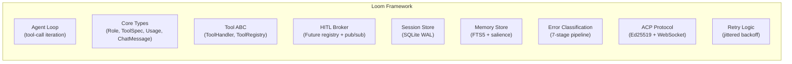

#### Façade + Adapter Pattern

Nexus does **not** use Loom's built-in server or runtime directly. Instead, it uses a **façade + adapter** pattern:

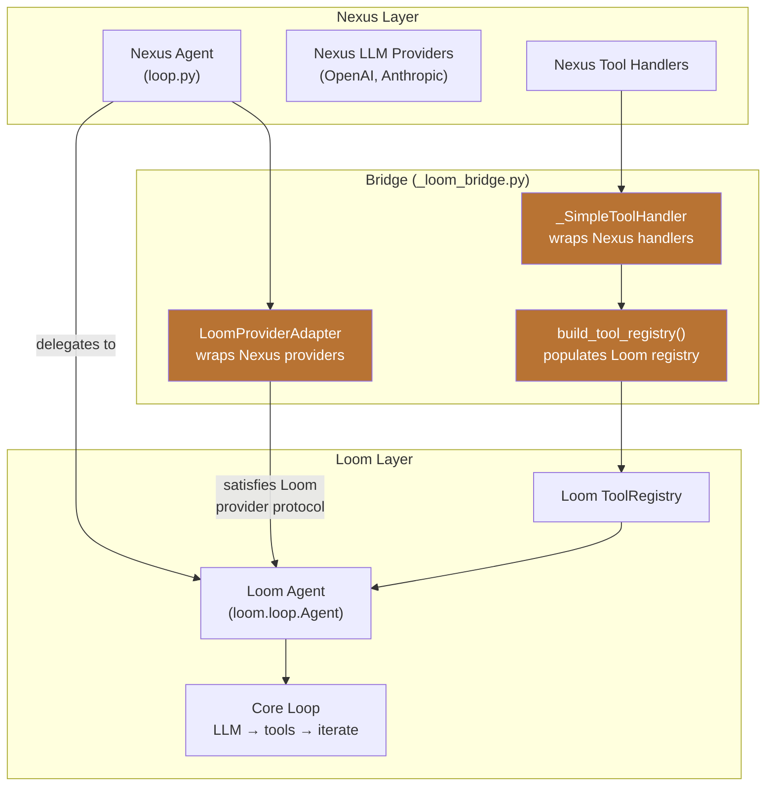

The bridge (`agent/src/nexus/agent/_loom_bridge.py`) resolves two key type divergences:

| Concern | Nexus | Loom | Bridge Solution |
|---------|-------|------|-----------------|
| `ToolCall.arguments` | `dict` | JSON `str` | `LoomProviderAdapter` converts at boundary |
| `ChatResponse` shape | flat (content + tool_calls) | wrapped (`message=ChatMessage(...)`) | `LoomProviderAdapter` wraps/unwraps |

#### Loom Modules Used by Nexus

| Loom Module | Nexus Usage |
|---|---|
| `loom.loop.Agent, AgentConfig` | Core agentic loop (tool-call iteration, retry, streaming) |
| `loom.tools.base.ToolHandler, ToolResult` | Base class for tool adapters |
| `loom.tools.registry.ToolRegistry` | Tool dispatch by name |
| `loom.hitl.HitlBroker, HitlEvent` | Session-scoped HITL Future registry + pub/sub |
| `loom.store.session.SessionStore` | SQLite session persistence (direct reuse) |
| `loom.store.memory.MemoryStore` | BM25 + salience memory recall |
| `loom.acp.AcpConfig, call_agent` | Agent Communication Protocol calls |
| `loom.errors.*` | 7-stage error classification pipeline |
| `loom.types.*` | Core types: `Role`, `ToolSpec`, `Usage`, `ChatMessage`, stream events |

### Agent Loop

The agent loop in `agent/src/nexus/agent/loop.py` is a façade over `loom.loop.Agent` that preserves the Nexus external API. Each turn follows this flow:

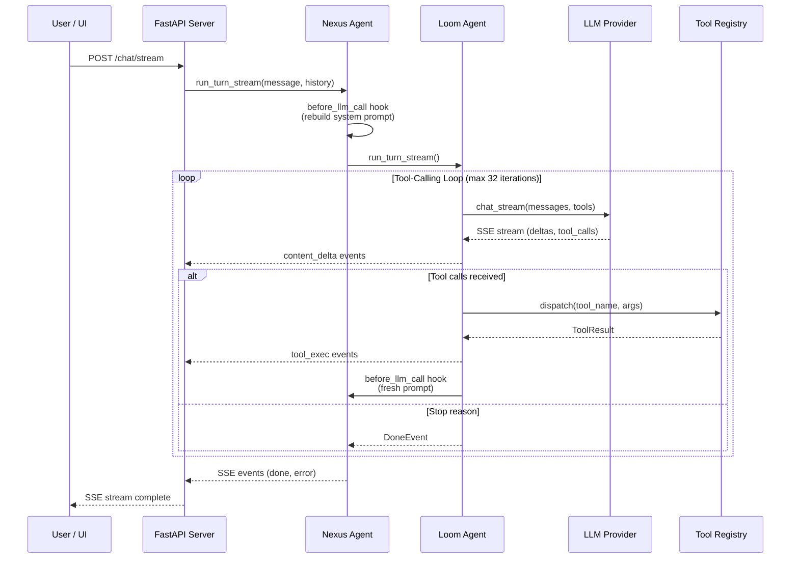

Key behaviors:

- **`before_llm_call` hook**: Rebuilds the system prompt on every iteration, ensuring the latest skill list and memory state are always current.
- **`choose_model` hook**: When routing mode is `auto`, scores and selects the best model per-turn.
- **Max iterations**: Default 32, configurable via `agent.max_iterations` in config.
- **Streaming**: `run_turn_stream()` translates Loom's Pydantic stream events into Nexus's lightweight dict-based SSE events.

### Progressive Disclosure

Token efficiency is critical. Nexus uses a progressive disclosure strategy for skills:

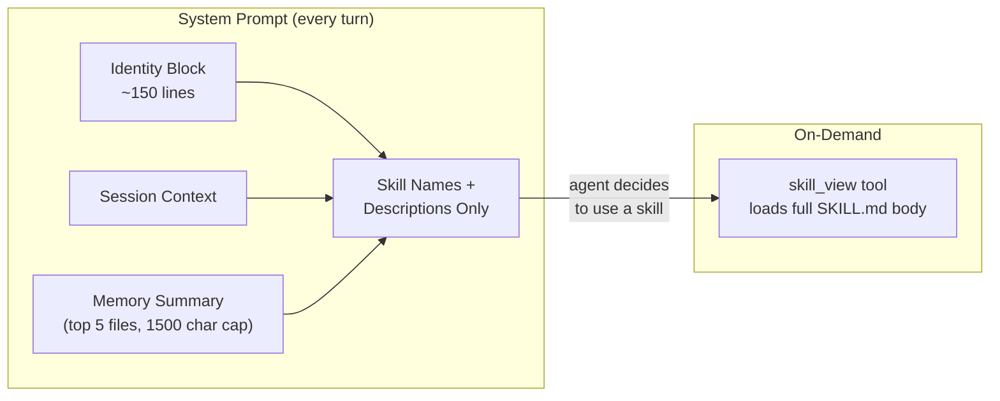

This keeps the system prompt small. The agent only pays the token cost of a full skill body when it actively decides to use it.

### Tool System

Nexus registers 17 tools into Loom's `ToolRegistry` via `build_tool_registry()` in `_loom_bridge.py`:

```mermaid
graph TB
    REG["Loom ToolRegistry"]

    subgraph "Knowledge Tools"
        VL["vault_list"]
        VR["vault_read"]
        VW["vault_write"]
        VS["vault_search"]
        VT["vault_tags"]
        VB["vault_backlinks"]
        KM["kanban_manage"]
    end

    subgraph "Skill Tools"
        SL["skills_list"]
        SV["skill_view"]
        SM["skill_manage<br/>(create/edit/patch/delete)"]
    end

    subgraph "Memory Tools"
        MR["memory_read"]
        MW["memory_write"]
        MC["memory_recall<br/>(BM25 + salience)"]
    end

    subgraph "External Tools"
        HTTP["http_call<br/>(GET/POST)"]
        ACP["acp_call<br/>(agent protocol)"]
    end

    subgraph "HITL Tools"
        ASK["ask_user<br/>(confirm/choice/text)"]
        TERM["terminal<br/>(shell commands)"]
    end

    REG --> VL & VR & VW & VS & VT & VB
    REG --> KM
    REG --> SL & SV & SM
    REG --> MR & MW & MC
    REG --> HTTP & ACP
    REG --> ASK & TERM

    style REG fill:#1a1a2e,color:#fff
```

Each tool is wrapped in a `_SimpleToolHandler` that adapts sync/async callables to Loom's `ToolHandler` ABC. HITL tools (`ask_user`, `terminal`) use late-binding via a mutable `AgentHandlers` container, allowing the server to wire them after construction.

### Vault & Knowledge Graph

The vault (`~/.nexus/vault/`) is a folder of markdown files with rich indexing:

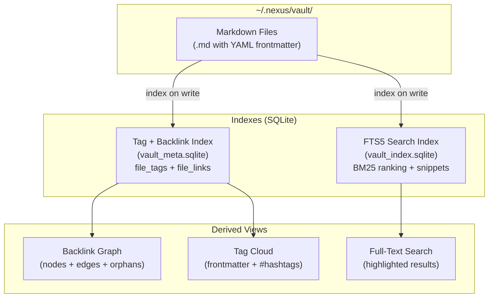

Features:

- **Atomic writes**: All file mutations use `tempfile.mkstemp` + `os.replace` to prevent corruption.
- **Path traversal protection**: `_safe_resolve()` prevents `../` attacks.
- **1 MiB file size limit**: Enforced on write.
- **Tag extraction**: From YAML frontmatter `tags:` lists and body `#hashtags` (code blocks excluded).
- **Backlink extraction**: From markdown link destinations and bare path mentions.
- **Graph API**: Returns nodes (path, size, folder), edges (from → to), and orphan nodes.

### Kanban System

Kanban boards are **vault-native** — stored as regular `.md` files with Obsidian-compatible format:

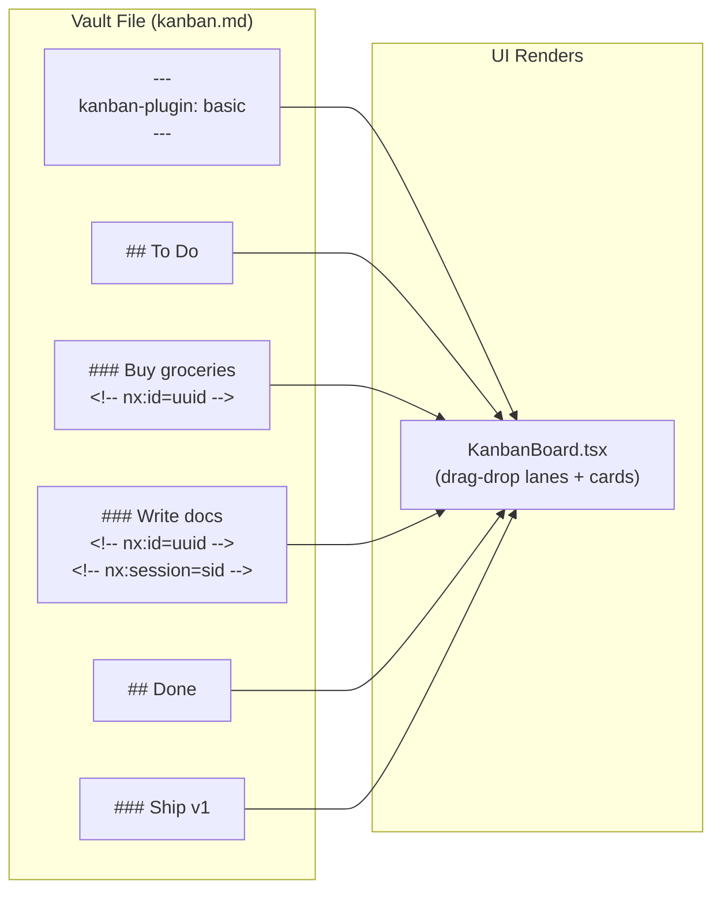

- **Format**: Obsidian Kanban plugin compatible (`kanban-plugin: basic` frontmatter).
- **Lanes**: `## Lane Title` headings with optional `<!-- nx:lane-id=<id> -->`.
- **Cards**: `### Card Title` headings with `<!-- nx:id=<uuid> -->` and optional `<!-- nx:session=<sid> -->`.
- **No separate store**: The vault IS the store. Kanban operations read/write the markdown directly.
- **Chat dispatch**: Cards can spawn chat sessions via `POST /vault/dispatch`, linking the session ID back into the card.

### Human-in-the-Loop (HITL)

Nexus supports two HITL channels per session, enabling real-time user interaction during agent turns:

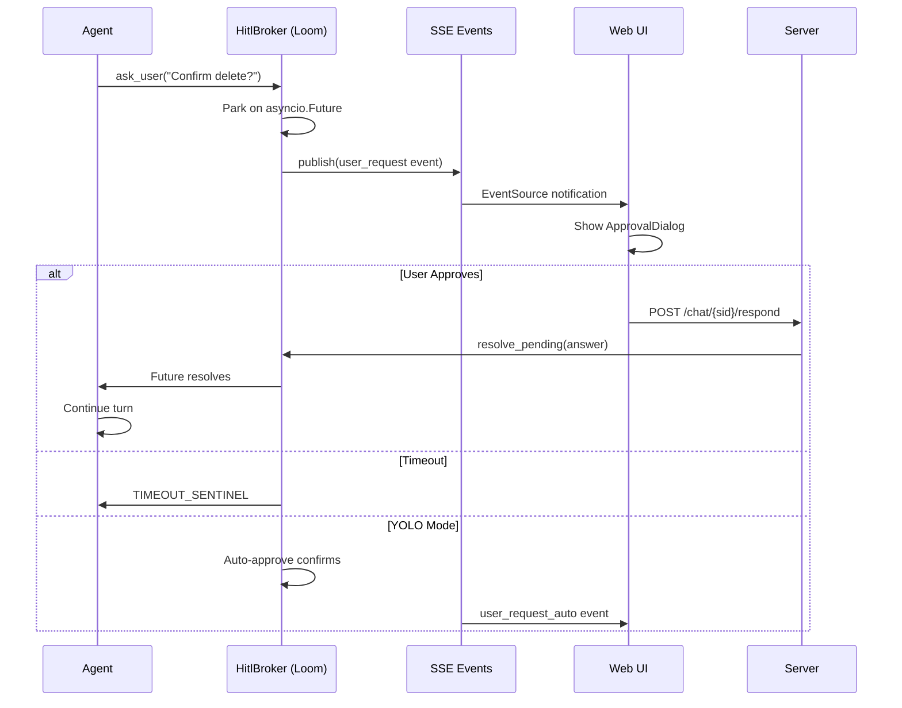

Two SSE channels:

1. **Per-turn SSE** (`POST /chat/stream`): Delivers `delta`, `tool`, `done`, `limit_reached`, `error` events during a single turn.
2. **Session-scoped SSE** (`GET /chat/{sid}/events`): Persistent channel for out-of-band events (`user_request`, `user_request_auto`, `user_request_cancelled`). The UI opens this *before* the first POST using a client-generated `pendingSessionId`, so approval dialogs never miss events.

### Skill System & Self-Evolution

The agent can author its own skills at runtime, enabling self-evolution:

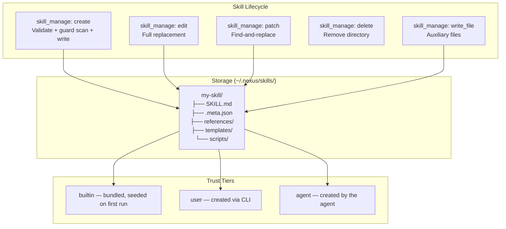

Skills are Markdown documents with YAML frontmatter:

```markdown
---
name: my-skill
description: Does something useful
---

# Instructions for the agent...
```

### Security Guard

Every agent-authored skill write passes through the security guard (`skills/guard.py`):

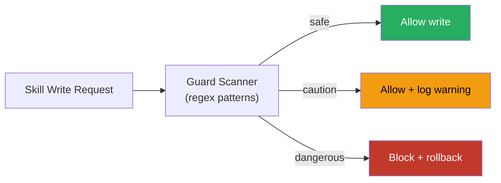

**Dangerous patterns** (blocks the write):
- Credential exfiltration: `curl $TOKEN`, `.ssh/`, `.aws/`, `base64 + env`
- Destructive commands: `rm -rf /`, `dd`, `mkfs`
- Prompt injection phrases

**Caution patterns** (allows but logs):
- Persistence mechanisms: `cron`, `launchd`, `systemd`, `.bashrc`

### Model Routing

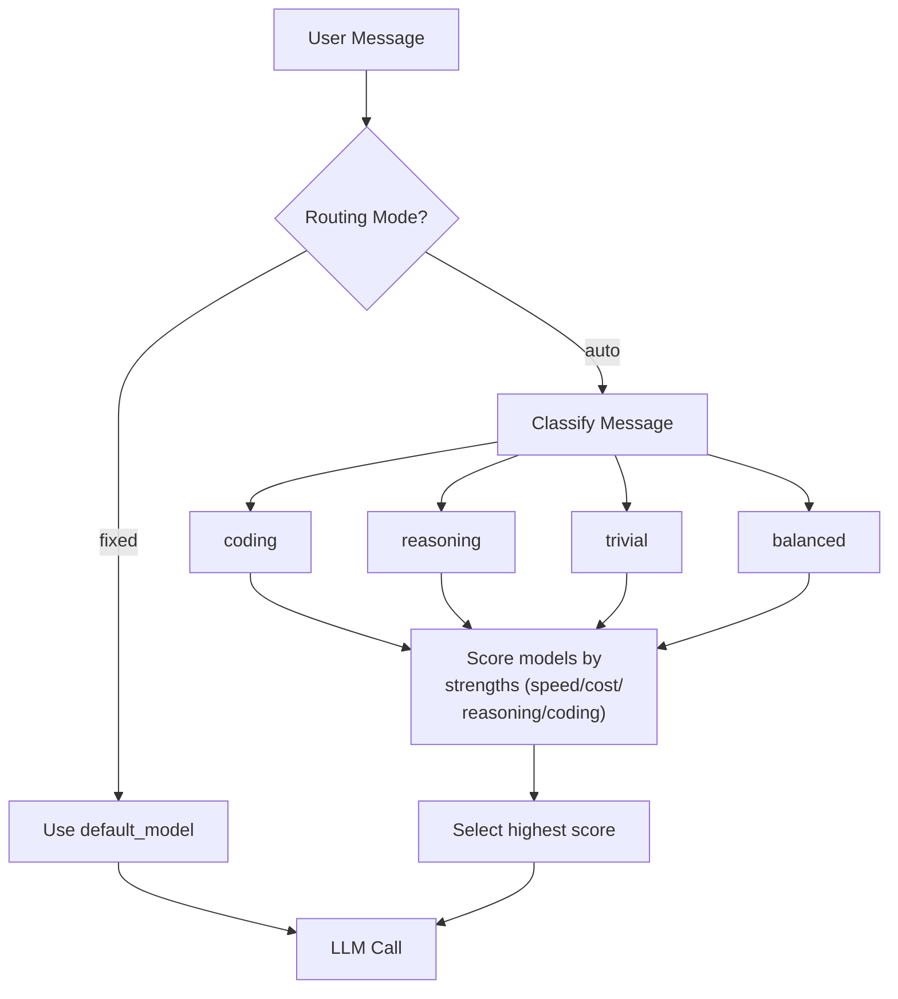

Classification uses regex patterns against the message content. Each configured model has strength scores (1-10) for speed, cost, reasoning, and coding. The highest-scoring model is selected per-turn.

### Configuration System

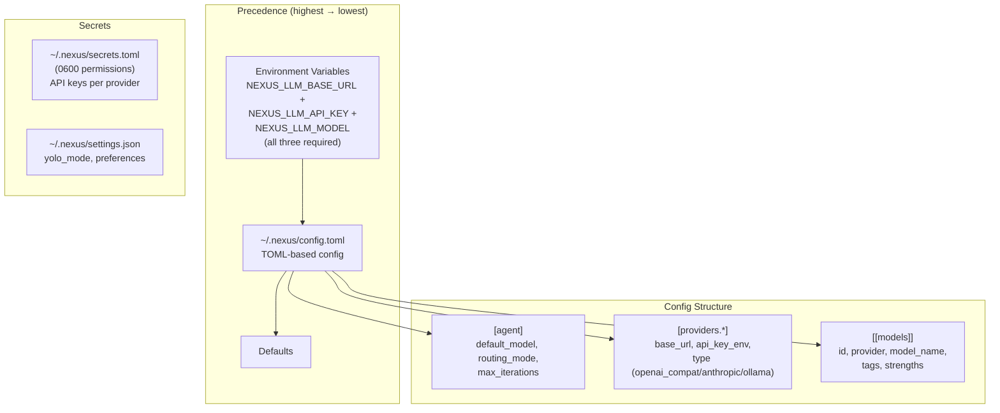

API keys are referenced by environment variable name (`key_env`), never stored inline in config. The secrets store at `~/.nexus/secrets.toml` is 0600 permission-guarded.

### Session Persistence

Sessions are persisted in SQLite (WAL mode) via Loom's `SessionStore`, extended by Nexus with FTS5 search:

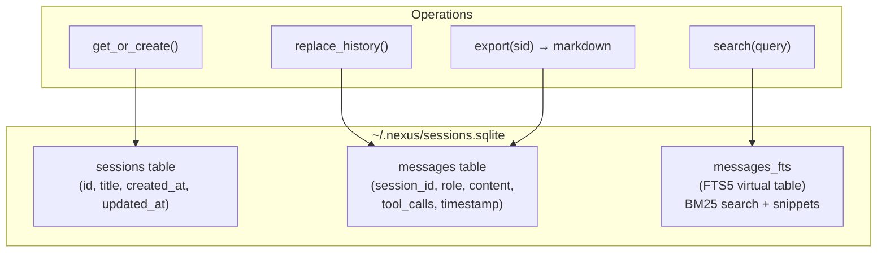

Legacy migration is handled automatically: pre-loom integer timestamps are converted to ISO format on first access.

### Daemon & Process Management

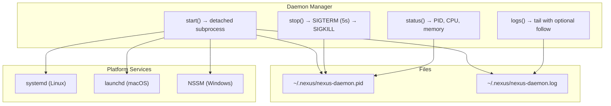

### Frontend Architecture

The frontend is a React 19 + Vite SPA with no external state management library:

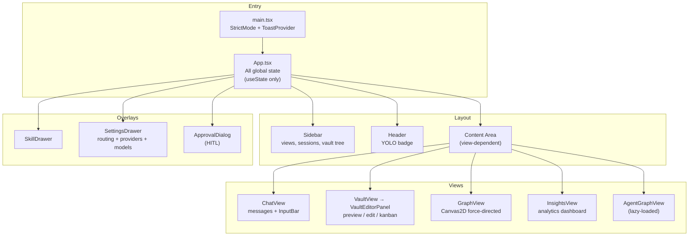

Key frontend design decisions:

| Decision | Implementation |
|----------|---------------|
| **State management** | All state in `App.tsx` via `useState` + `useCallback` + `useRef` — no Redux/Zustand |
| **Per-session state** | `Map<string, ChatState>` keyed by session ID, with a `__new__` slot for not-yet-created sessions |
| **View switching** | `display: none/flex` toggling, not conditional rendering — prevents losing in-flight streaming state |
| **SSE parsing** | Manual `ReadableStream` parsing for POST-based SSE; native `EventSource` for session-scoped events |
| **Mermaid rendering** | Lazy-loaded (~280KB gzipped) on first `language-mermaid` code block |
| **Agent graph** | `React.lazy()` loaded only when the `agentgraph` view is activated |
| **Canvas rendering** | Custom Canvas2D force-directed graph (not Cytoscape) with physics simulation |
| **Kanban detection** | `VaultEditorPanel` parses frontmatter for `kanban-plugin:` to decide render mode |

---

## Project Layout

```
nexus/
├── agent/                          # Python backend
│   ├── pyproject.toml              # Dependencies (loom as local editable)
│   └── src/nexus/
│       ├── __init__.py
│       ├── cli.py                  # Typer CLI entry point
│       ├── main.py                 # Uvicorn server entry point
│       ├── daemon.py               # Background process management
│       ├── config.py               # Legacy env-var config
│       ├── config_file.py          # TOML config (~/.nexus/config.toml)
│       ├── secrets.py              # API key store (0600 secrets.toml)
│       ├── redact.py               # Secret redaction for logs
│       ├── retry.py                # Jittered exponential backoff
│       ├── insights.py             # Session analytics engine
│       ├── usage_pricing.py        # Token cost estimation
│       ├── trajectory.py           # RL trajectory logger
│       ├── agent/                  # Core agent system
│       │   ├── loop.py             # Agent façade over Loom Agent
│       │   ├── _loom_bridge.py     # Type adapters (Nexus ↔ Loom)
│       │   ├── llm.py             # LLM providers (OpenAI, Anthropic)
│       │   ├── prompt_builder.py   # System prompt with progressive disclosure
│       │   ├── registry.py         # Provider registry
│       │   ├── router.py           # Auto-routing model selection
│       │   ├── planner.py          # Planner-executor split routing
│       │   ├── context.py          # ContextVar for session_id
│       │   ├── ask_user_tool.py    # HITL ask_user tool
│       │   └── terminal_tool.py    # HITL terminal tool
│       ├── server/                 # FastAPI application
│       │   ├── app.py             # All route definitions
│       │   ├── schemas.py          # Pydantic request/response models
│       │   ├── events.py           # SSE event dataclass
│       │   ├── session_store.py    # SQLite sessions over Loom
│       │   ├── settings.py         # User preferences (YOLO mode)
│       │   └── graph.py            # Agent/skill/session graph
│       ├── skills/                 # Skill lifecycle
│       │   ├── types.py            # Skill Pydantic model
│       │   ├── registry.py         # SkillRegistry (disk scanning)
│       │   ├── manager.py          # SkillManager (CRUD + guard)
│       │   └── guard.py            # Regex security scanner
│       ├── tools/                  # Agent tools
│       │   ├── vault_tool.py       # vault_list/read/write/search/tags/backlinks
│       │   ├── kanban_tool.py      # kanban_manage
│       │   ├── state_tool.py       # skills_list + skill_view
│       │   ├── memory_tool.py      # memory_read/write/recall
│       │   ├── http_call.py        # HTTP GET/POST
│       │   └── acp_call.py         # Agent Communication Protocol
│       ├── vault.py                # Vault file operations
│       ├── vault_search.py         # FTS5 full-text search index
│       ├── vault_index.py          # Tag + backlink index
│       ├── vault_graph.py          # Backlink graph builder
│       ├── vault_kanban.py         # Kanban parser/serializer
│       ├── vault_provider.py       # Loom VaultProvider adapter
│       └── error_classifier.py     # Error classification shim
├── ui/                             # React frontend
│   ├── package.json               # React 19, Vite 6, TypeScript 5.7
│   ├── vite.config.ts             # Dev server on port 1890
│   ├── tsconfig.json              # Strict mode, ES2022
│   └── src/
│       ├── App.tsx                # Root component (all state)
│       ├── api.ts                 # All API communication + SSE
│       ├── App.css                # Two-column layout
│       ├── tokens.css             # Design tokens
│       ├── toast/                 # Toast notification system
│       └── components/
│           ├── ChatView.tsx       # Chat messages + input
│           ├── VaultView.tsx      # Vault wrapper
│           ├── GraphView.tsx      # Force-directed graph
│           ├── InsightsView.tsx   # Analytics dashboard
│           ├── AgentGraphView.tsx # Agent graph (lazy)
│           ├── KanbanBoard.tsx    # Drag-drop kanban
│           ├── MarkdownView.tsx   # react-markdown + mermaid
│           ├── VaultEditorPanel.tsx # File editor (3 modes)
│           ├── Sidebar.tsx        # Navigation + sessions
│           ├── SettingsDrawer.tsx # Settings panel
│           ├── ApprovalDialog.tsx # HITL approval modal
│           └── ...                # 20+ other components
├── skills/                         # Bundled skills (seeded on first run)
│   └── hello-world/SKILL.md
├── CLAUDE.md                       # AI assistant guidance
├── PLAN.md                         # Full design document
├── install.sh                      # One-line installer
└── LICENSE                         # Apache 2.0
```

---

## Getting Started

### One-Line Install

```bash
curl -fsSL https://raw.githubusercontent.com/NinoCoelho/nexus/main/install.sh | bash
```

Clones into `~/nexus` (override with `NEXUS_DIR=…`), installs [uv](https://docs.astral.sh/uv/) if missing, runs `uv sync` + `npm install`, writes a default `~/.nexus/config.toml`, and drops a `nexus` launcher into `~/.local/bin/`.

Env overrides: `NEXUS_DIR`, `NEXUS_REF`, `NEXUS_NO_UI=1`, `NEXUS_NO_INIT=1`.

### Manual Install

Prerequisites: Python 3.12+, [uv](https://docs.astral.sh/uv/) (`brew install uv`), Node 20+.

```bash
# Clone both repos side by side
git clone git@github.com:NinoCoelho/loom.git ../loom
git clone git@github.com:NinoCoelho/nexus.git
cd nexus/agent

# Install backend
uv sync

# First-time config
uv run nexus config init

# Set API keys
export OPENAI_API_KEY=sk-...
export ANTHROPIC_API_KEY=sk-ant-...

# Verify
uv run nexus config show
uv run nexus providers list
uv run nexus models list
```

### Run

#### Daemon Mode (Recommended)

```bash
uv run nexus daemon start          # background daemon on port 18989
uv run nexus daemon status         # PID, CPU, memory
uv run nexus daemon logs           # tail logs
uv run nexus daemon stop           # graceful shutdown
```

#### System Service

```bash
uv run nexus daemon install --user    # systemd/launchd auto-start
uv run nexus daemon uninstall --user
```

#### Manual Server

```bash
uv run nexus serve --port 18989    # foreground

# Frontend (separate terminal)
cd ../ui
npm install
npm run dev                        # http://localhost:1890
```

#### CLI Only

```bash
uv run nexus chat                  # interactive TUI
```

On first run, bundled skills from `skills/` are copied into `~/.nexus/skills/` and marked `trust="builtin"`.

---

## CLI Reference

### Daemon Management

```bash
nexus daemon start [--host 127.0.0.1] [--port 18989] [--detach/--no-detach]
nexus daemon stop
nexus daemon restart
nexus daemon status
nexus daemon logs [--lines 50] [--follow]
nexus daemon install [--user|--system]
nexus daemon uninstall [--user|--system]
```

### Server & Chat

```bash
nexus serve [--port 18989] [--host 127.0.0.1]
nexus chat  [--session <id>] [--model <id>] [--context <str>]
```

### Configuration

```bash
nexus config init | show | path
nexus providers list | add <name> --base-url <url> [--key-env <VAR>] | remove <name>
nexus models    list | add <id> --provider <p> --model <name> [--tags ...] | remove <id> | set-default <id>
nexus routing   set <fixed|auto>
nexus skills    list | view <name> | remove <name>
```

### Advanced

```bash
nexus sessions list | show <id> | export <id> | import <path>
nexus vault ls | search <query> | reindex | tags | backlinks <path>
nexus kanban boards | list [--board default]
nexus insights [--days 30] [--json]
```

---

## API Reference

### Chat & HITL

| Route | Method | Description |
|-------|--------|-------------|
| `/chat` | POST | Non-streaming turn |
| `/chat/stream` | POST | SSE per-turn stream (deltas, tool calls, done) |
| `/chat/{sid}/events` | GET | SSE session-scoped events (user_request, cancellations) |
| `/chat/{sid}/pending` | GET | Recover pending HITL request after page reload |
| `/chat/{sid}/respond` | POST | Resolve pending HITL request |
| `/chat/{sid}/cancel` | POST | Cancel in-flight turn |

### Sessions

| Route | Method | Description |
|-------|--------|-------------|
| `/sessions` | GET | List sessions |
| `/sessions/search` | GET | FTS5 search with BM25 |
| `/sessions/{sid}` | GET | Get session with messages |
| `/sessions/{sid}` | PATCH | Rename session |
| `/sessions/{sid}` | DELETE | Delete session |
| `/sessions/{sid}/export` | GET | Export as markdown |
| `/sessions/{sid}/to-vault` | POST | Save to vault (raw or LLM-summarized) |
| `/sessions/import` | POST | Import from markdown |

### Vault

| Route | Method | Description |
|-------|--------|-------------|
| `/vault/tree` | GET | File tree listing |
| `/vault/file` | GET | Read file (with tags + backlinks) |
| `/vault/file` | PUT | Write file |
| `/vault/file` | DELETE | Delete file |
| `/vault/folder` | POST | Create folder |
| `/vault/search` | GET | FTS5 search |
| `/vault/reindex` | POST | Rebuild search index |
| `/vault/graph` | GET | Backlink graph |
| `/vault/move` | POST | Move/rename file |
| `/vault/tags` | GET | Tag index |
| `/vault/tags/{tag}` | GET | Files for a tag |
| `/vault/backlinks` | GET | Backlinks for a file |
| `/vault/dispatch` | POST | Create session seeded from vault file/card |

### Kanban

| Route | Method | Description |
|-------|--------|-------------|
| `/vault/kanban` | GET | Read board |
| `/vault/kanban` | POST | Create board |
| `/vault/kanban/cards` | POST | Add card |
| `/vault/kanban/cards/{id}` | PATCH | Update/move card |
| `/vault/kanban/cards/{id}` | DELETE | Delete card |
| `/vault/kanban/lanes` | POST | Add lane |
| `/vault/kanban/lanes/{id}` | DELETE | Delete lane |

### Config, Providers, Models

| Route | Method | Description |
|-------|--------|-------------|
| `/config` | GET/PATCH | View/update config |
| `/providers` | GET | List providers with key status |
| `/providers/{name}/models` | GET | Fetch upstream models |
| `/providers/{name}/key` | POST/DELETE | Set/clear API key |
| `/models` | GET/POST/DELETE | Model CRUD |
| `/routing` | GET/PUT | Routing config |
| `/settings` | GET/POST | YOLO mode toggle |

### Other

| Route | Method | Description |
|-------|--------|-------------|
| `/health` | GET | Liveness check |
| `/skills` | GET | List skills |
| `/skills/{name}` | GET | Full SKILL.md |
| `/graph` | GET | Agent/skill/session graph |
| `/insights` | GET | Token/cost/model/tool analytics |

---

## Configuration Guide

The canonical config lives at `~/.nexus/config.toml`:

```toml
[agent]
default_model = "gpt-4o"
routing_mode = "fixed"       # "fixed", "auto", or "planner"
max_iterations = 32

[providers.openai]
type = "openai_compat"
base_url = "https://api.openai.com/v1"
api_key_env = "OPENAI_API_KEY"

[providers.anthropic]
type = "anthropic"
base_url = "https://api.anthropic.com"
api_key_env = "ANTHROPIC_API_KEY"

[providers.local]
type = "ollama"
base_url = "http://localhost:11434/v1"

[[models]]
id = "gpt-4o"
provider = "openai"
model_name = "gpt-4o"
tags = ["fast", "capable"]

[models.strengths]
speed = 7
cost = 4
reasoning = 8
coding = 8

[[models]]
id = "claude-sonnet"
provider = "anthropic"
model_name = "claude-sonnet-4-20250514"
tags = ["reasoning", "coding"]

[models.strengths]
speed = 6
cost = 5
reasoning = 9
coding = 9
```

### Environment Variable Override

When **all three** of these are set, they override the config file:

```bash
export NEXUS_LLM_BASE_URL="https://api.openai.com/v1"
export NEXUS_LLM_API_KEY="sk-..."
export NEXUS_LLM_MODEL="gpt-4o"
```

### Data Directory Layout

```
~/.nexus/
├── config.toml          # Main configuration
├── secrets.toml         # API keys (0600)
├── settings.json        # UI preferences (YOLO mode)
├── sessions.sqlite      # Session + message storage
├── vault/               # Markdown knowledge base
│   └── **/*.md
├── vault_index.sqlite   # FTS5 search index
├── vault_meta.sqlite    # Tag + backlink index
├── skills/              # Agent skills
│   └── <name>/
│       ├── SKILL.md
│       └── .meta.json
├── memory/              # Agent memory files
├── nexus-daemon.pid     # Daemon PID file
└── nexus-daemon.log     # Daemon log file
```

---

## Design Tokens

The UI uses a warm dark slate + copper + sage palette. All tokens are defined as CSS custom properties in `ui/src/tokens.css`.

---

## License

Licensed under the [Apache License 2.0](LICENSE).

```
Copyright 2024 Nino Coelho

Licensed under the Apache License, Version 2.0 (the "License");
you may not use this file except in compliance with the License.
You may obtain a copy of the License at

    http://www.apache.org/licenses/LICENSE-2.0

Unless required by applicable law or agreed to in writing, software
distributed under the License is distributed on an "AS IS" BASIS,
WITHOUT WARRANTIES OR CONDITIONS OF ANY KIND, either express or implied.
See the License for the specific language governing permissions and
limitations under the License.
```
